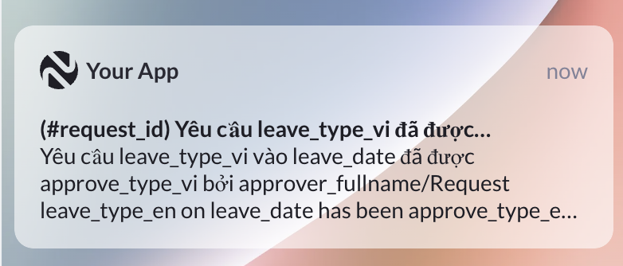
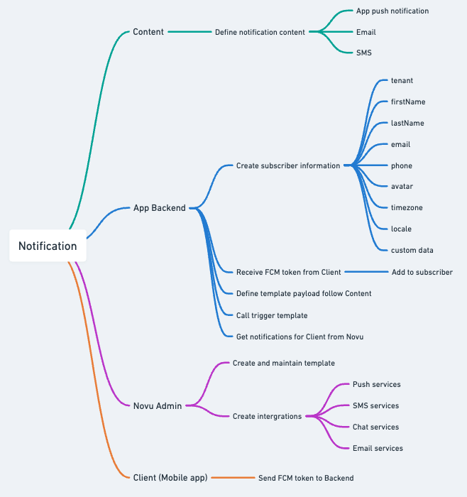
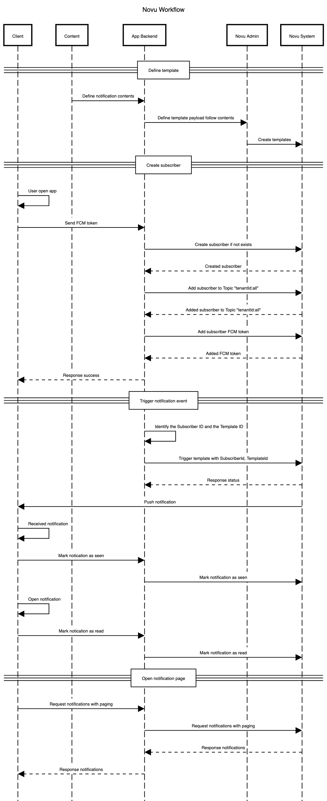

# Novu - Notification Center

REST API: [https://api.novu.co/api#/](https://api.novu.co/api#/)

## 1. Giới thiệu

Novu là một nền tảng mã nguồn mở giúp quản lý và gửi các loại thông báo như push notification, email, SMS một cách tập trung và linh hoạt. Giải pháp này được đề xuất để tối ưu hóa quy trình gửi thông báo trong hệ thống công ty, giảm sự phụ thuộc vào mã nguồn backend và tăng tính linh hoạt cho quản trị viên.

## 2. Chuẩn bị để sử dụng Novu

### 2.1. Tạo topic mặc định (Novu Admin)

- Novu có thể push notification cho **Topic** hoặc **User** cụ thể.
- Nên có Topic mặc định để hỗ trợ cho những tác vụ push notification cho all user.
- Khi khởi tạo tenant, admin sẽ tạo Topic All mặc định theo mẫu `<tenantId>:<topicId>`
- VD: `tenant_dev:all`

### 2.2. Đăng ký Novu Subscribers

- **Novu Subscribers** là danh sách users (bao gồm những thông tin cơ bản) tương ứng với từng tenant.
- Backend sẽ cung cấp **API để Client gửi FCM Token**. Khi Client call API này, Backend sẽ Upsert Novu Subscribers. Sau đó mới add FCM Token vào Subscribers vừa upsert.
- Xác định subscriberId theo tenantId và mã định danh (thường dùng email) theo mẫu `<tenantId>:<userId>`.
- VD: `tenant_dev:example.user@imespro.com`

**cURL upsert subscribers**

```bash
curl --location 'https://dev-novu-api.imespro.com/v2/subscribers' \
--header 'Authorization: ApiKey {API_KEY}' \
--header 'Content-Type: application/json' \
--data-raw '{
    "subscriberId": "{TENANT_ID:EMAIL}",
    "firstName": "Họ Lót Tên",
    "lastName": "",
    "email": "{EMAIL}",
    "locale": "vi"
}'
```

**cURL Add FCM Token**

```bash
curl --location --request PATCH 'https://dev-novu-api.imespro.com/v1/subscribers/{TENANT_ID:EMAIL}/credentials' \
--header 'Authorization: ApiKey {API_KEY}' \
--header 'Content-Type: application/json' \
--data '{
  "providerId": "fcm",
  "integrationIdentifier": "{INTEGRATION_IDENTIFIER}",
  "credentials": {
    "channel": "general",
    "deviceTokens": [
      "{FCM_TOKEN}"
    ]
  }
}'
```

- Backend sẽ cung cấp **API để Client đăng ký Topic** (Bắt buộc đăng ký Topic All). **Backend tự thêm TenantId** vào Topic mà Client gửi lên trước khi gửi cho Novu.

**cURL Subscribe Topic**

```bash
curl --location 'https://dev-novu-api.imespro.com/v1/topics/{TENANT_ID:TOPIC}/subscribers' \
--header 'Authorization: ApiKey {API_KEY}' \
--header 'Content-Type: application/json' \
--data-raw '{
  "subscribers": [
    "{TENANT_ID:EMAIL}"
  ]
}'
```

### 2.3. Xác định template thông báo

- **Mô tả**: Mỗi loại thông báo (push notification, email, SMS) cần được định nghĩa dưới dạng template. Mỗi template bao gồm nội dung và các biến payload (ví dụ: {{userName}}, {{orderId}}) để cá nhân hóa thông báo.
- **Ví dụ** template yêu cầu phê duyệt ngày công:
  - Tiêu đề: "(#{{requestId}}) Trình phê duyệt xác nhận chấm công"
  - Nội dung: "Yêu cầu phê duyệt xác nhận ngày công cho {{requesterFullName}}"

### 2.4. Thiết lập workflow

- **Quy trình**:
  - Admin sử dụng giao diện Novu để định nghĩa workflow dựa trên các template đã tạo.
  - Mỗi template sẽ có **2 workflow** tương ứng với hai ngôn ngữ: tiếng Việt và tiếng Anh.
  - Workflow xác định kênh gửi (email, SMS, push), thời gian gửi, và các điều kiện (nếu có).
- **Ví dụ**:
  - Template "Yêu cầu phê duyệt ngày công" sẽ có:
    - Workflow 1: Gửi email tiếng Việt.
    - Workflow 2: Gửi email tiếng Anh.

### 2.5. Trigger thông báo từ Backend

**Quy trình**:

- Backend xác định:
  - Template ID tương ứng với loại thông báo.
  - Danh sách người nhận (recipient).
  - Ngôn ngữ của người nhận (dựa trên profile hoặc cài đặt hệ thống).

- Gọi API Novu để trigger thông báo với các tham số:
  - TEMPLATE_ID: ID của template.
  - Gửi đến: List gồm Subscriber hoặc Topic sẽ nhận thông báo.
  - Payload: Các biến (như requestId, requesterFullName).

**cURL**

```bash
curl --location 'https://dev-novu-api.imespro.com/v1/events/trigger' \
--header 'Authorization: ApiKey {API_KEY}' \
--header 'Content-Type: application/json' \
--data-raw '{
    "name": "{TEMPLATE_ID}",
    "to": [
        {
          "subscriberId": "{TENANT_ID:EMAIL}",
          "type": "Subscriber"
        },
        {
          "topicKey": "{TENANT_ID:TOPIC}",
          "type": "Topic"
        },
        {
          "subscriberId": "{TENANT_ID:EMAIL}",
          "type": "Subscriber"
        }
    ],
    "payload": {
        "request_id": "123456",
        "requester_fullname": "Hồ Hoàng Hải",
        "leave_type_vi": "Nghỉ phép năm",
        "leave_type_en": "Annual Leave",
        "leave_date": "2025-06-13",
        "tenant": {
            "identifier": "{TENANT_ID}"
        }
    },
    "overrides": {
        "fcm": {
            "type": "notification",
            "data": {
                "request_id": "123456",
                "requester_fullname": "Hồ Hoàng Hải",
                "leave_type_vi": "Nghỉ phép năm",
                "leave_type_en": "Annual Leave",
                "leave_date": "2025-06-13"
            }
        }
    }
}'
```

#### 2.5.1. Ví dụ template Leave request created

- ID: leave-request-created
- Title: `(#{{request_id}}) {{requester_fullname}} trình phê duyệt {{leave_type_vi}}/{{leave_type_en}} request`
- Body: `Yêu cầu phê duyệt {{leave_type_vi}} vào {{leave_date}}/ {{leave_type_en}} request on {{leave_date}}`

#### 2.5.2. Ví dụ template Leave request updated

- ID: leave-request-updated
- Title: `(#{{request_id}}) Yêu cầu {{leave_type_vi}} đã được {{approve_type_vi}}/{{leave_type_en}} request has been {{approve_type_en}}`
- Body: `Yêu cầu {{leave_type_vi}} vào {{leave_date}} đã được {{approve_type_vi}} bởi {{approver_fullname}}/Request {{leave_type_en}} on {{leave_date}} has been {{approve_type_en}} by {{approver_fullname}}`



### 2.6. Load danh sách Thông báo để hiển thị trên Client

**cURL**

```bash
curl --location 'https://dev-novu-api.imespro.com/v1/subscribers/{TENANT_ID:EMAIL}/notifications/feed?page=0&limit=20' \
--header 'Authorization: ApiKey {API_KEY}'
```

### 2.7. Đánh dấu Thông báo Đã nhận/Đã đọc

**cURL đánh dấu 1 thông báo**

```bash
curl --location 'https://dev-noti-center.imespro.com/api/v1/subscribers/{TENANT_ID:EMAIL}/messages/mark-as' \
--header 'Authorization: ApiKey {API_KEY}' \
--header 'Content-Type: application/json' \
--data '{
  "messageId": "{NOTIFICATION_ID}",
  "markAs": "seen" // read || seen || unread || unseen
}'
```

**cURL đánh dấu tất cả thông báo của subscriber**

```bash
curl --location 'https://dev-noti-center.imespro.com/api/v1/subscribers/{TENANT_ID:EMAIL}/messages/mark-all' \
--header 'Authorization: ApiKey {API_KEY}' \
--header 'Content-Type: application/json' \
--data '{
  "markAs": "unseen"
}'
```

## 3. Ưu điểm của Novu

1. **Tính linh hoạt trong quản lý template**:
   - Admin có thể dễ dàng chỉnh sửa nội dung template qua giao diện Novu mà không cần can thiệp vào mã nguồn backend.
   - So với cách truyền thống (sửa code và deploy), Novu tiết kiệm thời gian và giảm nguy cơ lỗi.

2. **Giảm tải cho Backend**:
   - Backend chỉ cần xác định templateId, người nhận, và payload, không cần quản lý nội dung thông báo.
   - Tăng tính tái sử dụng mã nguồn và giảm độ phức tạp.

3. **Hỗ trợ đa kênh**:
   - Novu tích hợp nhiều kênh (email, SMS, push notification) trong một nền tảng, giúp quản lý tập trung.

## 4. Nhược điểm của Novu

1. **Yêu cầu thêm vai trò quản trị**:
   - Cần tạo vai trò admin Novu để quản lý template và workflow, tăng khối lượng công việc cho đội ngũ vận hành.

2. **Rủi ro khi Novu gặp sự cố**:
   - Nếu dịch vụ Novu bị downtime, toàn bộ hệ thống thông báo của các client sẽ bị ảnh hưởng.
   - Cần có kế hoạch dự phòng như sử dụng dịch vụ gửi thông báo khác hoặc lưu trữ lại các request lỗi để khi Novu bình thường trở lại vẫn có thể retry được.

3. **Hạn chế về lịch sử chỉnh sửa**:
   - Novu hiện không cung cấp tính năng xem lịch sử chỉnh sửa workflow, gây khó khăn trong việc theo dõi và kiểm soát thay đổi.

## 5. Đề xuất triển khai

1. **Quy trình quản trị**:
   - Phân quyền rõ ràng cho admin Novu: chỉ những người có thẩm quyền mới được chỉnh sửa template/workflow.
   - Backup template/workflow để theo dõi thay đổi (do Novu chưa hỗ trợ lịch sử chỉnh sửa).

2. **Kế hoạch dự phòng**:
   - Xây dựng cơ chế fallback (ví dụ: tích hợp thêm Firebase Cloud Messaging cho push notification hoặc Twilio cho SMS) để đảm bảo hệ thống thông báo hoạt động liên tục khi Novu gặp sự cố.
   - Xây dựng cơ chế lưu trữ khi gửi request vào Novu fail để có thể retry khi cần thiết.

## 6. Vai trò



## 7. Workflow



```mermaid
title Novu Workflow

participant Client
participant Content
participant App Backend
participant Novu Admin
participant Novu System

==Define template==
Content->App Backend: Define notification contents
App Backend->Novu Admin: Define template payload follow contents
Novu Admin->Novu System: Create templates
==Create subscriber==
Client->Client: User open app
Client->App Backend: Send FCM token
App Backend->Novu System: Create subscriber if not exists
Novu System-->App Backend: Created subscriber
App Backend->Novu System: Add subscriber to Topic "tenantId:all"
Novu System-->App Backend: Added subscriber to Topic "tenantId:all"
App Backend->Novu System: Add subscriber FCM token
Novu System-->App Backend: Added FCM token
App Backend-->Client: Response success
==Trigger notification event==
App Backend->App Backend: Identify the Subscriber ID and the Template ID
App Backend->Novu System: Trigger template with SubscriberId, TemplateId
Novu System-->App Backend: Response status
Novu System->Client: Push notification
Client->Client: Received notification
Client->App Backend: Mark notication as seen
App Backend->Novu System: Mark notification as seen
Client->Client: Open notification
Client->App Backend: Mark notication as read
App Backend->Novu System: Mark notification as read
==Open notification page==
Client->App Backend: Request notifications with paging
App Backend->Novu System: Request notifications with paging
Novu System-->App Backend: Response notifications
App Backend->Client: Response notifications
```

## 8. Kết luận

Việc áp dụng Novu giúp đơn giản hóa quy trình quản lý và gửi thông báo, giảm tải cho đội ngũ phát triển backend và tăng tính linh hoạt cho quản trị viên. Tuy nhiên, cần lưu ý các nhược điểm như yêu cầu quản trị bổ sung và rủi ro khi dịch vụ gặp sự cố. Với kế hoạch triển khai và dự phòng hợp lý, Novu sẽ là giải pháp hiệu quả cho hệ thống thông báo của công ty.
